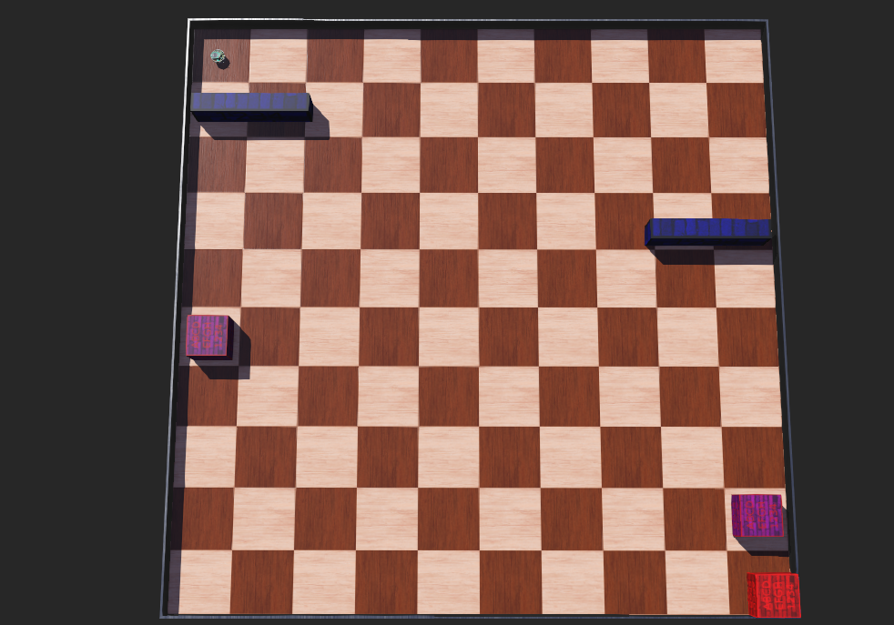
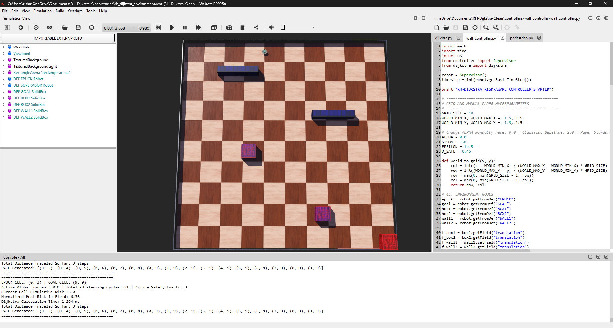
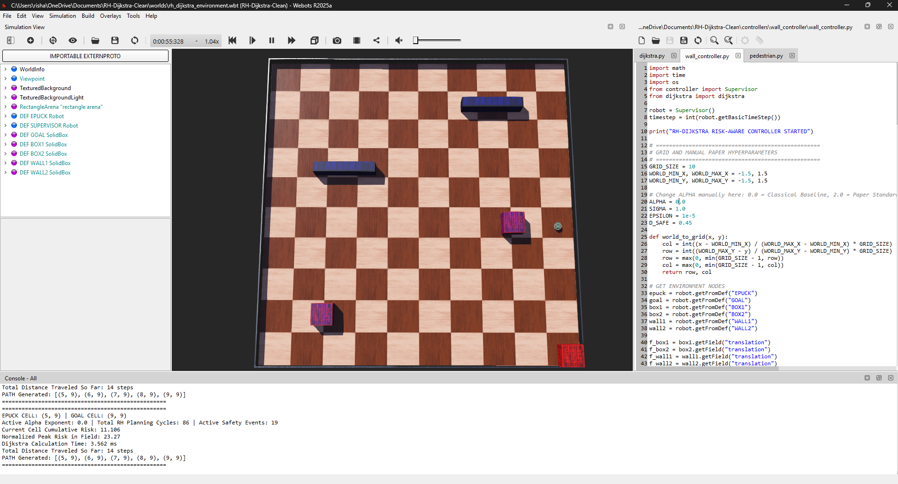
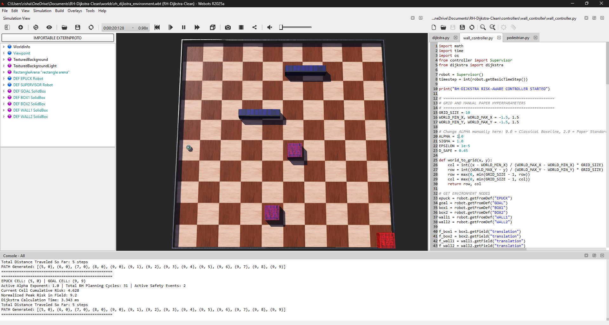
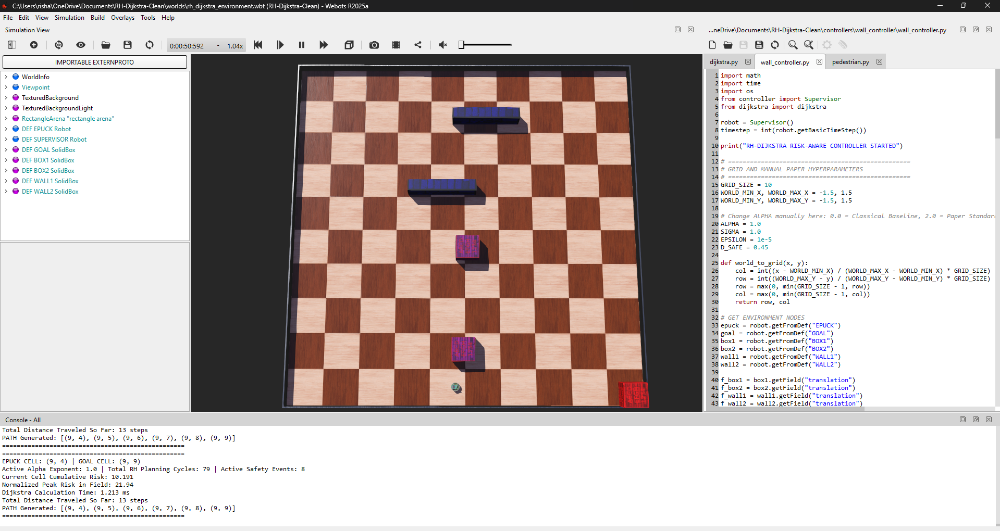
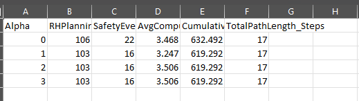

# Recursive Heatmap Dijkstra Path Planning in Webots


## 🎥 Demonstration Video

Click the thumbnail below to watch the complete simulation demonstration including real-time replanning, obstacle avoidance behavior, risk-map evolution, and experimental evaluation.

 [](https://youtu.be/bDEnAkktaOg)

▶️ **Watch the full simulation video here:**  
https://youtu.be/bDEnAkktaOg

---

Webots implementation of the Recursive Heatmap Dijkstra (RH-Dijkstra) risk-aware path planning algorithm for mobile robots operating in dynamic and uncertain environments using Gaussian risk maps and PID trajectory tracking.

This project was developed as part of an academic exploration of risk-aware mobile robot navigation using Webots and the e-puck robot platform. It presents an educational implementation and evaluation inspired by the Recursive Heatmap Dijkstra (RH-Dijkstra) methodology described in the reference literature.

Target Audience: This repository is intended for students, robotics enthusiasts, and researchers interested in:

- Mobile robot navigation
- Risk-aware path planning
- Dynamic obstacle avoidance
- Webots simulation environments
- Autonomous robotics research

---

## ✨ Features

- Recursive Heatmap Dijkstra (RH-Dijkstra) implementation
- Dynamic obstacle avoidance
- Gaussian risk diffusion modeling
- PID trajectory tracking
- Automatic CSV telemetry logging
- Risk sensitivity experiments across multiple α values
- Webots R2025a compatible
- e-puck robot integration
- Dynamic replanning support

---


## 📜 Academic Attribution & Reference

This work reproduces the key conceptual ideas of the RH-Dijkstra architecture within a custom simulation environment for educational experimentation, evaluation, and learning. The underlying mathematical and cost-shaping formulations are attributed to:

* **Paper Title:** Recursive Heatmap Dijkstra-Based Risk Aware Path Planning for Mobile Robots in Dynamic and Uncertain Environments
* **Authors:** Baris Yasin Demir and Yavuz Eren (*Marmara University / Yildiz Technical University*)
* **Journal:** IEEE Access (Volume 14, 2026)
* **DOI:** [10.1109/ACCESS.2026.3692299](https://doi.org/10.1109/ACCESS.2026.3692299)

### 🧠 Core Mathematical Formulation

The path cost function evaluates a candidate node $n$ by combining its geometric edge weight with a non-linear risk penalty term parameterized by an adaptive exponent parameter $\alpha$:

$$Cost(n) = \text{Distance}(current, n) + \beta \cdot \text{Risk}(n)^\alpha$$

* When $\alpha = 0.0$: The penalty simplifies to a constant background risk factor, causing the controller to default into a classical baseline shortest-path router.
* When $\alpha \ge 1.0$: The cost field scales non-linearly with proximity to dynamic hazards, pushing the optimized path boundary away from high-risk sectors.

---

## 🛠️ Simulation Configuration & Specifications

This framework was evaluated using the following software stack and simulation configuration:

* **Simulator Version:** Webots R2025a (Tested)
* **Python Version:** Python 3.10+
* **Robot Platform:** e-puck (Differential-Drive)
* **Grid Resolution:** 10 × 10 Discrete Cell Nodes
* **Dynamic Obstacles:** 4 Synchronized Moving Hazards
* **Planning Method:** Recursive Heatmap Dijkstra (RH-Dijkstra)
* **Motion Controller:** Discrete-Time PID Heading Tracking
* **Risk Diffusion Kernel:** Two-Dimensional Isotropic Gaussian

---

## 🚀 Author Contributions & Implementation Scope

The Webots implementation scene, supervisor tracking files, controller integration, and empirical framework were developed independently in this project:

* **Simulation Environment Design:** Built the custom 10×10 grid world map with synchronized dynamic and static hazards.
* **Proactive Risk Diffusion:** Developed the live-updating historical visitation heatmap smoothed via two-dimensional Gaussian convolution kernels to model cumulative environmental danger over time.
* **Dynamic Replanning Architecture:** Integrated a 4-connected topology graph-search engine recomputing paths dynamically upon safety perimeter breaches.
* **Low-Level Locomotion Tracking:** Engineered a discrete-time closed-loop PID heading tracking controller to maintain path tracking and physical vehicle stability.
* **Automated Data Logging Pipeline:** Built a custom supervisor module that calculates and appends operational benchmarks directly to an external database file on simulation completion.

---

## 🔍 Scope Boundaries (What Was Not Implemented)

To maintain project feasibility within the current simulation development cycle, certain specialized configurations and comparative testing cases from the reference paper were intentionally left outside the scope of this project:

* **Norm-Bounded Uncertainty Modeling ($\|w_k\|_2 \le \rho$):** Section III-C of the paper introduces an uncertainty radius around obstacle vectors to expand safety margins against sensing anomalies. This implementation utilizes direct access to simulator ground-truth position information through the supervisor node, assuming accurate state estimation.
* **Large-Scale Multi-Scenario Benchmarking:** The reference study evaluates multiple environment configurations and comparative planning scenarios, including larger grid layouts and D\* Lite comparisons. This implementation focuses on a single 10×10 environment with dynamic hazards to study recursive replanning behavior and risk-aware cost shaping.
* **Alternative Experimental Metrics:** The authors report specific performance profiles including Time-to-Goal (TG), Heading Error RMS (HE-RMS), and Rejoining Penalty (RP). This study instead evaluates the environment through path length, risk exposure indices, total planning cycles, and safety event metrics.

---

## 🖥️ Simulation Environment & Runtime Setup

### Webots Arena Layout

*Figure 1: 10×10 discrete grid simulation arena featuring the e-puck platform, target goal, and synchronized dynamic hazards.*

### Runtime Navigation Demonstration
When $\alpha = 0.0$ (Classical Baseline), the robot follows the shortest diagonal path. When $\alpha \ge 1.0$, it automatically recalculates a safe bypass route down the left flank of the grid map.

| Initial Route Staging | Mid-Path Hazard Avoidance |
| :---: | :---: |
|  |  |
| **Bypass Route Staging** | **Bypass Path Clearance** |
|  |  |

*Figure 2: Runtime navigation timeline showing dynamic path updates used to guide the e-puck around moving hazards.*

---

## 📊 Experimental Evaluation & Sensitivity Results

The following benchmarking data was generated directly from simulation runs performed in this project across various risk-sensitivity configurations ($\alpha$):

| Alpha Setting ($\alpha$) | RH Planning Cycles | Safety Events (Breaches) | Avg Computation Time | Cumulative Risk Exposure | Total Path Length (Steps) |
| :--- | :---: | :---: | :---: | :---: | :---: |
| **0.0 (Blind Baseline)** | 106 | 22 | 3.47 ms | 632.49 | 17 |
| **1.0 (Linear Risk)** | 103 | 16 | 3.25 ms | 619.29 | 17 |
| **2.0 (Paper Standard)** | 103 | 16 | 3.51 ms | 619.29 | 17 |
| **3.0 (Aggressive Aversion)**| 103 | 16 | 3.51 ms | 619.29 | 17 |

### Empirical Data Log Matrix

*Figure 3: Empirical telemetry data automatically logged by the supervisor controller upon goal arrival during simulation runs.*

### 🔍 Key Engineering Findings

* **Perimeter Violation Mitigation:** Transitioning from the baseline pathfinder ($\alpha = 0.0$) to active cost-shaping ($\alpha \ge 1.0$) yielded an immediate **27.3% reduction** in safety events (dropping from 22 down to 16 events) within the tested environment.
* **Discrete Optimization Stability:** Due to the discrete cell topology of the graph, the path layout plateaus optimally at $\alpha = 1.0$, demonstrating robust behavioral consistency as risk scaling grows steeper; the environment did not contain enough competing paths with different risk profiles to alter the trajectory further at higher exponents.
* **Real-Time Execution Feasibility:** Across all trials, global recomputation times consistently stayed below 4.0 milliseconds, demonstrating the feasibility of real-time execution within the tested simulation environment.

---

## 📁 Repository Structure

```text
RH-Dijkstra/
├── controllers/
│   ├── wall_controller/
│   │   ├── dijkstra.py            # Core 4-connected shortest path search engine
│   │   └── wall_controller.py      # Supervisor controller, data logging, & risk map logic
│   └── pedestrian/
│       └── pedestrian.py        # PID low-level trajectory execution tracker
├── worlds/
│   └── rh_dijkstra_environment.wbt # Webots 10x10 world scene file
├── data/
│   └── sensitivity_study.csv      # Automatically compiled CSV benchmarks sheet
├── images/
│   ├── webots_environment.png   # Full application workspace screen setup
│   ├── arena_environment.png      # Close-up layout view of the grid arena
│   ├── runtime_navigation_1.png   # Pass 1 start location snapshot
│   ├── runtime_navigation_1.1.png # Pass 1 midpoint snapshot
│   ├── runtime_navigation_2.png   # Pass 2 alternative route snapshot
│   ├── runtime_navigation_2.1.png # Pass 2 timeline progression snapshot
│   └── sensitivity_results.png    # Spreadsheet metrics data log crop snippet
├── LICENSE                        # Open-source MIT License
└── README.md                      # Documentation file

 ```
## 🚀 Installation & Replication Guide

Follow these exact steps to set up the workspace, open the consoles, modify hyperparameters, and run simulations locally using Webots.

---

### 1️⃣ Clone the Repository

Download or clone the repository files to your local machine:

```bash
git clone https://github.com/Rerishabh/RH-Dijkstra-Webots.git
```

Then enter the project directory:

```bash
cd RH-Dijkstra-Webots
```

---

### 2️⃣ Launch Webots & Open the Simulation World

1. Open **Webots R2025a** (or a newer compatible version).
2. Click the **Open an existing world file** button (📂 Folder icon) on the top toolbar, or navigate to:

   ```
   File → Open World...
   ```

3. Select and open:

   ```
   worlds/rh_dijkstra_environment.wbt
   ```

---

### 3️⃣ Open the Built-in Code Editors

To ensure all project files are initialized and visible alongside the 3D simulation view:

1. Navigate to the top menu bar and click:

   ```
   Tools → Text Editor
   ```

   Shortcut:

   ```
   Ctrl + E
   ```

2. If required, use the **Open Existing Text File** button inside the editor panel to load:

   ```
   controllers/wall_controller/dijkstra.py
   controllers/wall_controller/wall_controller.py
   controllers/pedestrian/pedestrian.py
   ```

---

### 4️⃣ Open the Output Execution Console

To observe live coordinates, planning cycles, computation timings, and path updates:

1. Open:

   ```
   Tools → New Console
   ```

   Shortcut:

   ```
   Ctrl + N
   ```

2. A dedicated **Console - All** panel will appear at the bottom of the interface and stream runtime information generated by the controllers.

---

### 5️⃣ Tune Risk Sensitivity Parameters

1. Open:

   ```
   controllers/wall_controller/wall_controller.py
   ```

2. Locate the global parameter:

   ```python
   ALPHA = 2.0
   ```

3. Modify it according to the desired experiment configuration:

   ```python
   ALPHA = 0.0   # Classical shortest path baseline
   ALPHA = 1.0   # Moderate risk awareness
   ALPHA = 2.0   # Paper standard configuration
   ALPHA = 3.0   # High risk aversion
   ```

4. Save the script using:

   ```
   Ctrl + S
   ```

   or click the floppy disk icon in the Webots editor toolbar.

---

### 6️⃣ Run & Reset the Simulation

#### ▶️ Run Simulation

Click the **Play** button on the top toolbar to start execution.

During runtime, the simulator will:

- Generate Gaussian risk maps
- Execute RH-Dijkstra planning cycles
- Continuously update navigation commands
- Print runtime statistics to the console
- Automatically append metrics to:

```text
data/sensitivity_study.csv
```

---

#### 🔄 Test Additional Parameter Configurations

To run a new experiment:

1. Click **Pause**.
2. Click **Reset Simulation**.
3. Modify the `ALPHA` parameter.
4. Save the file (`Ctrl + S`).
5. Press **Play** again.

The environment, obstacles, and robot will reset to their initial conditions for the next experiment.

---

## ✅ Expected Output

Upon successful completion, the console will display metrics similar to:

```text
FINAL REPORT METRICS
Alpha Setting                 : 2.0
Total RH Planning Cycles      : 31
Total Safety Events           : 0
Avg Computation Time          : 4.62 ms
Cumulative Risk Exposure      : 14.28
Total Path Length             : 19 steps
TARGET REACHED SUCCESSFULLY
```

The experiment statistics will also be stored automatically in:

```text
data/sensitivity_study.csv
```
