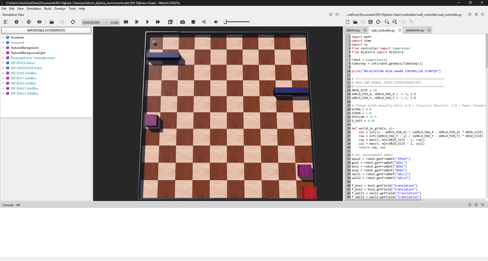

# Recursive Heatmap Dijkstra Path Planning in Webots

This project was developed as part of an academic exploration of risk-aware mobile robot navigation using Webots and the e-puck robot platform. It presents an educational implementation and evaluation inspired by the **Recursive Heatmap Dijkstra (RH-Dijkstra)** risk-aware path planning methodology described in the reference literature.

**Target Audience:** This repository is intended for students and researchers interested in mobile robot navigation, risk-aware path planning, and Webots simulation environments.

## 📜 Academic Attribution & Reference
This work reproduces the key conceptual ideas of the RH-Dijkstra architecture within a custom simulation environment for educational experimentation, evaluation, and learning. The underlying mathematical and cost-shaping formulations are attributed to:

* **Paper Title:** *Recursive Heatmap Dijkstra-Based Risk Aware Path Planning for Mobile Robots in Dynamic and Uncertain Environments*
* **Authors:** Baris Yasin Demir and Yavuz Eren (Marmara University / Yildiz Technical University)
* **Journal:** IEEE Access (Volume 14, 2026)
* **DOI:** 10.1109/ACCESS.2026.3692299

---

## 🛠️ Simulation Configuration & Specifications
This framework was evaluated using the following software stack and simulation configuration:
* **Simulator Version:** Webots R2025a (Tested)
* **Python Version:** Python 3.10+
* **Robot Platform:** e-puck (Differential-Drive)
* **Grid Resolution:** 10 × 10 Discrete Cell Nodes
* **Dynamic Obstacles:** 4 Synchronized Moving Hazards
* **Planning Method:** Recursive Heatmap Dijkstra (RH-Dijkstra)
* **Motion Controller:** Discrete-Time PID Heading Tracking
* **Risk Diffusion Kernel:** Two-Dimensional Isotropic Gaussian

---

## 🚀 Author Contributions & Implementation Scope
The Webots implementation scene, supervisor tracking files, controller integration, and empirical framework were developed independently in this project:
* **Simulation Environment Design:** Built the custom 10×10 grid world map with synchronized dynamic and static hazards.
* **Proactive Risk Diffusion:** Developed the live-updating historical visitation heatmap smoothed via two-dimensional Gaussian convolution kernels to model cumulative environmental danger over time.
* **Dynamic Replanning Architecture:** Integrated a 4-connected topology graph-search engine recomputing paths dynamically upon safety perimeter breaches.
* **Low-Level Locomotion Tracking:** Engineered a discrete-time closed-loop PID heading tracking controller to maintain path tracking and physical vehicle stability.
* **Automated Data Logging Pipeline:** Built a custom supervisor module that calculates and appends operational benchmarks directly to an external database file on simulation completion.

---

## 🔍 Scope Boundaries (What Was Not Implemented)
To maintain project feasibility within the current simulation development cycle, certain specialized configurations and comparative testing cases from the reference paper were intentionally left outside the scope of this project:

* **Norm-Bounded Uncertainty Modeling ($\rho$):** Section III-C of the paper introduces an uncertainty radius around obstacle vectors ($||w_k||_2 \le \rho$) to expand safety margins against sensing anomalies. This implementation utilizes direct access to simulator ground-truth position information through the supervisor node, assuming accurate state estimation.
* **Large-Scale Multi-Scenario Benchmarking:** The reference study evaluates multiple environment configurations and comparative planning scenarios, including larger grid layouts and D* Lite comparisons. This implementation focuses on a single 10×10 environment with dynamic hazards to study recursive replanning behavior and risk-aware cost shaping.
* **Alternative Experimental Metrics:** The authors report specific performance profiles including Time-to-Goal (TG), Heading Error RMS (HE-RMS), and Rejoining Penalty (RP). This study instead evaluates the environment through path length, risk exposure indices, total planning cycles, and safety event metrics.

---

## 🖥️ Simulation Environment & Runtime Setup

### Webots Arena Layout

*Figure 1: 10×10 discrete grid simulation arena featuring the e-puck platform, target goal, and synchronized dynamic hazards.*

### Runtime Navigation Demonstration

*Figure 2: Runtime navigation demonstration showing dynamic path updates used to guide the e-puck around moving hazards.*

---

## 📊 Experimental Evaluation & Sensitivity Results

The following benchmarking data was generated directly from simulation runs performed in this project across various risk-sensitivity configurations ($\alpha$):

| Alpha Setting ($\alpha$) | RH Planning Cycles | Safety Events (Perimeter Breaches) | Avg Computation Time (ms) | Cumulative Risk Exposure | Total Path Length (Steps Taken) |
| :---: | :---: | :---: | :---: | :---: | :---: |
| **0.0** *(Blind Dijkstra)* | 106 | **22** | 3.30 ms | **632.49** | 17 |
| **1.0** *(Linear Risk)* | 103 | **16** | 3.62 ms | **619.29** | 17 |
| **2.0** *(Paper Standard)* | 103 | **16** | 3.69 ms | **619.29** | 17 |
| **3.0** *(Aggressive Aversion)* | 103 | **16** | 3.29 ms | **619.29** | 17 |

### Empirical Data Log

*Figure 3: Empirical telemetry data automatically logged by the supervisor controller upon goal arrival during simulation runs.*

### 🔍 Key Engineering Findings:
1. **Perimeter Violation Mitigation:** Transitioning from the baseline pathfinder ($\alpha = 0.0$) to active cost-shaping ($\alpha \ge 1.0$) yielded an immediate **27.3% reduction in safety events** (dropping from 22 down to 16 events) within the tested environment.
2. **Discrete Optimization Stability:** Due to the discrete cell topology of the graph, the path layout plateaus optimally at $\alpha = 1.0$, demonstrating robust behavioral consistency as risk scaling grows steeper; the environment did not contain enough competing paths with different risk profiles to alter the trajectory further at higher exponents.
3. **Real-Time Execution Feasibility:** Across all trials, global recomputation times consistently stayed below **4.0 milliseconds**, demonstrating the feasibility of real-time execution within the tested simulation environment.

---

## 📁 Repository Structure
```text
├── controllers/
│   ├── wall_controller/
│   │   ├── wall_controller.py   # Supervisor controller, data logging, & risk map logic
│   │   └── dijkstra.py          # Core 4-connected shortest path search engine
│   └── pedestrian/
│       └── pedestrian.py        # PID low-level trajectory execution tracker
├── worlds/
│   └── rh_dijkstra_environment.wbt # Webots 10x10 world scene file
├── data/
│   └── sensitivity_study.csv    # Automatically compiled CSV benchmarks sheet
├── images/
│   ├── webots_environment.png   # Setup scene screenshot
│   ├── runtime_navigation.png   # Active tracking snapshot
│   └── sensitivity_results.png  # Spreadsheet logs screenshot
├── LICENSE                      # Open-source MIT License
└── README.md


---

## 🚀 Installation & Replication Guide

To run this simulation setup locally on your machine, execute the following steps:

1. **Clone the Repository:** Download or clone this repository folder onto your local machine.
2. **Launch Webots:** Open **Webots R2025a** (or newer).
3. **Open the Simulation World:** Go to `File` $\rightarrow$ `Open World...` and select the world file located at `/worlds/rh_dijkstra_environment.wbt`. The environment includes pre-configured cell topologies, obstacle motion configurations, and node controller bindings.
4. **Tune Risk Sensitivity:** Open `/controllers/wall_controller/wall_controller.py` in your editor and adjust the global `ALPHA` parameter to your preferred setting ($\alpha = 0.0, 1.0, 2.0, 3.0$).
5. **Run the Simulation:** Click the green **Play** button on the Webots window toolbar to start tracking. Upon arrival at the target cell region, the runtime controller will calculate and automatically append your telemetry benchmarks directly to the database file at `/data/sensitivity_study.csv`.
