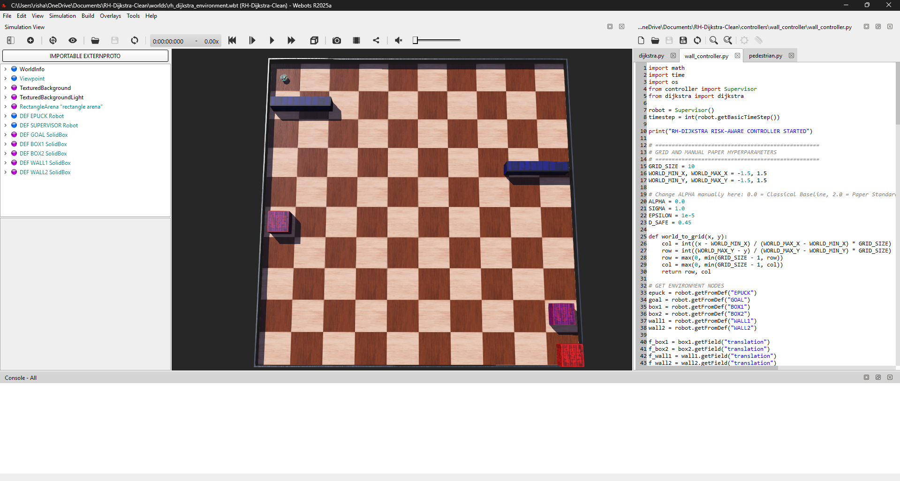
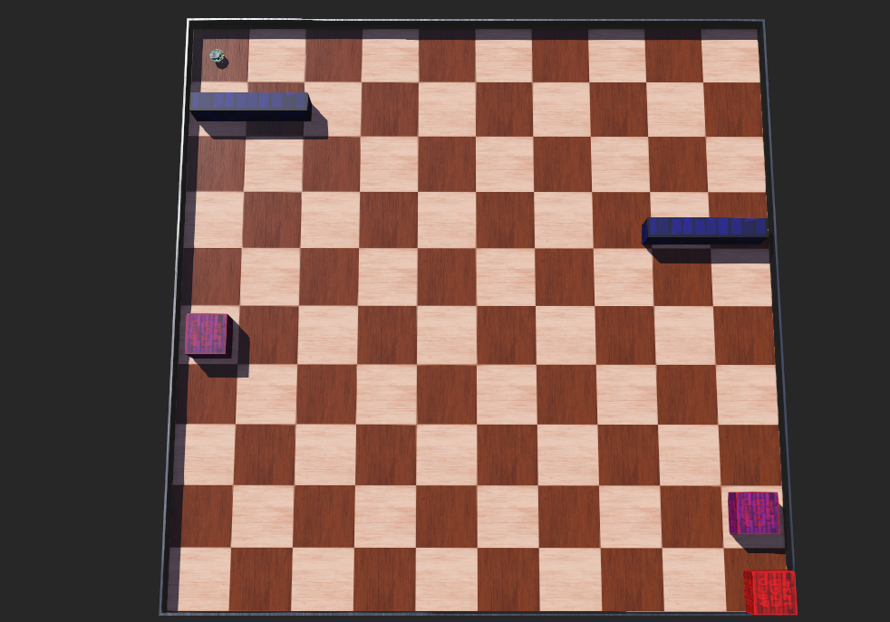
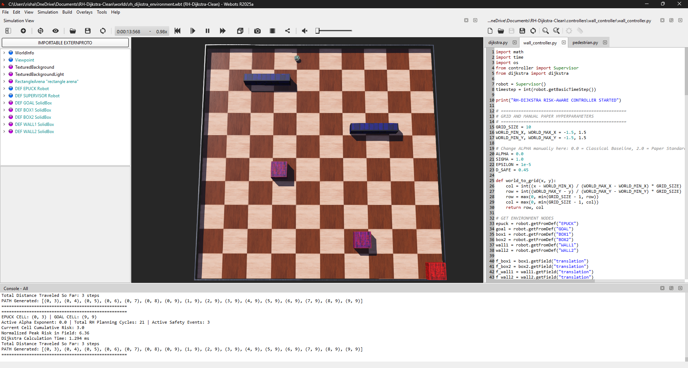
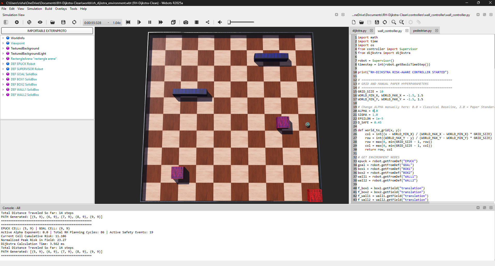
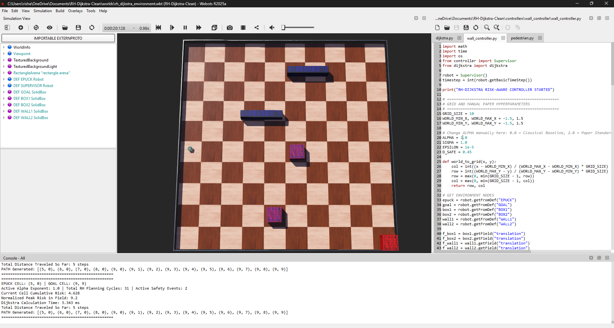
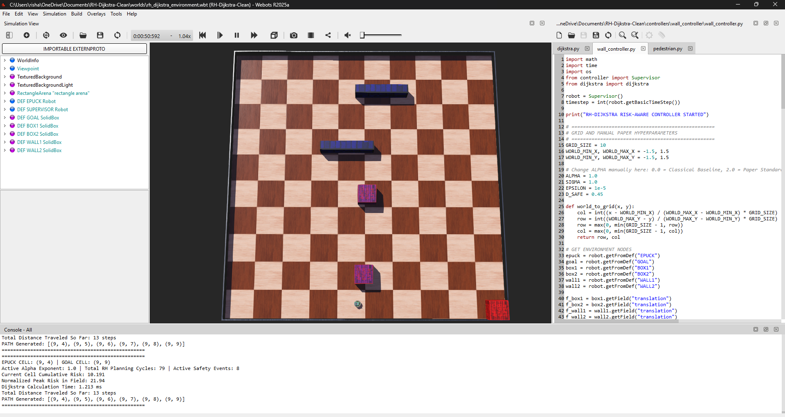
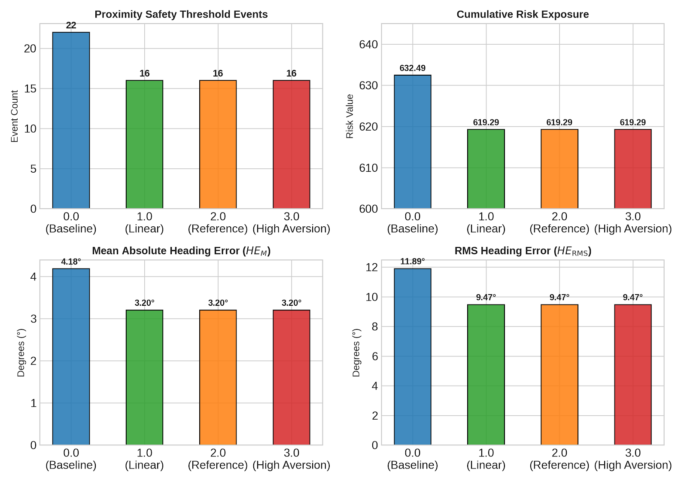
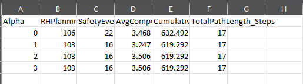
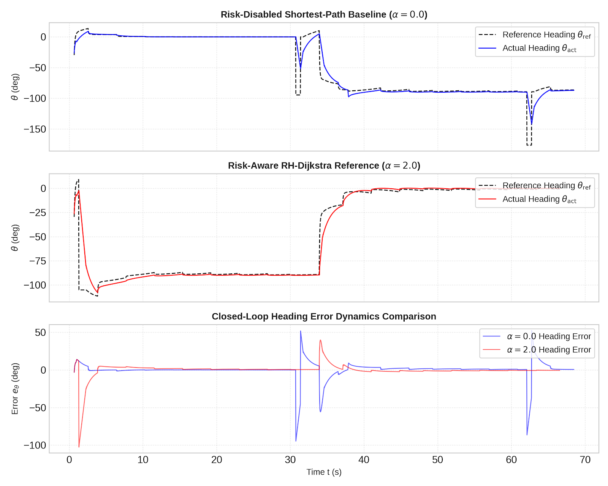

# Recursive Heatmap Dijkstra Path Planning in Webots

## 🎥 Demonstration Video

Watch the RH-Dijkstra planner perform real-time risk-aware navigation in Webots using Gaussian risk maps, dynamic obstacle avoidance, and PID trajectory tracking.

### RH-Dijkstra in Webots Demo

▶️ **Watch the full simulation video here:**  
https://youtu.be/bDEnAkktaOg

Webots implementation of the Recursive Heatmap Dijkstra (RH-Dijkstra) risk-aware path planning methodology for mobile robots operating in dynamic environments using Gaussian risk maps and PID trajectory tracking.

This project was developed as part of an academic exploration of risk-aware mobile robot navigation using Webots and the e-puck robot platform. It presents an educational implementation and evaluation inspired by the Recursive Heatmap Dijkstra (RH-Dijkstra) methodology described in the reference literature.

**Target Audience:** This repository is intended for students, robotics enthusiasts, and researchers interested in:

* Mobile robot navigation
* Risk-aware path planning
* Dynamic obstacle avoidance
* Webots simulation environments
* Autonomous robotics research

---

## ✨ Features

* Recursive Heatmap Dijkstra-inspired risk-aware planning
* 10×10 discrete navigation grid
* 4-connected weighted Dijkstra search
* Dynamic obstacle tracking
* Historical obstacle visitation map
* Two-dimensional Gaussian risk diffusion
* Risk-sensitive traversal cost shaping
* Periodic online replanning
* Differential-drive e-puck robot
* PID-based heading tracking
* Heading-error telemetry logging
* Automatic CSV experiment logging
* Risk-sensitivity experiments for multiple $\alpha$ values
* Safety-threshold monitoring
* Planning-time measurement
* Cumulative sampled heatmap exposure measurement
* Webots R2025a compatible

---

## 📁 Repository Structure

```text
RH-Dijkstra-Webots/
├── controllers/
│   ├── wall_controller/
│   │   ├── dijkstra.py
│   │   └── wall_controller.py
│   └── pedestrian/
│       └── pedestrian.py
│
├── worlds/
│   ├── rh_dijkstra_environment.wbt
│   └── .rh_dijkstra_environment.wbproj
│
├── data/
│   ├── sensitivity_study.csv
│   ├── tracking_alpha_0.0.csv
│   ├── tracking_alpha_1.0.csv
│   ├── tracking_alpha_2.0.csv
│   └── tracking_alpha_3.0.csv
│
├── images/
│   ├── arena_environment.png
│   ├── runtime_navigation_1.png
│   ├── runtime_navigation_1.1.png
│   ├── runtime_navigation_2.png
│   ├── runtime_navigation_2.1.png
│   ├── sensitivity_analysis.png
│   ├── sensitivity_results.png
│   ├── tracking_heading_comparison.png
│   └── webots_environment.png
│
├── rh_dijkstra_environment.mp4
├── rh_dijkstra_environment_1.mp4
├── LICENSE
└── README.md
```

### Main Files

* `dijkstra.py` — Core 4-connected weighted shortest-path search engine.
* `wall_controller.py` — Supervisor controller responsible for dynamic obstacles, risk-map generation, planning, safety monitoring, and experiment logging.
* `pedestrian.py` — Low-level e-puck PID waypoint-tracking controller.
* `sensitivity_study.csv` — Summary metrics generated from the tested $\alpha$ configurations.
* `tracking_alpha_*.csv` — Timestep-level heading telemetry from individual experiments.

---

## 📜 Academic Attribution & Reference

This work reproduces selected conceptual ideas of the RH-Dijkstra architecture within a custom simulation environment for educational experimentation, evaluation, and learning. The underlying methodology and risk-aware planning concepts are attributed to:

* **Paper Title:** *Recursive Heatmap Dijkstra-Based Risk Aware Path Planning for Mobile Robots in Dynamic and Uncertain Environments*
* **Authors:** Baris Yasin Demir and Yavuz Eren
* **Affiliations:** Marmara University / Yildiz Technical University
* **Journal:** IEEE Access, Volume 14, 2026
* **DOI:** 10.1109/ACCESS.2026.3692299

This repository is an independent implementation and does not claim to reproduce every mathematical component, experimental scenario, or numerical result reported in the reference paper.

---

## 🧠 Core Mathematical Formulation

The path cost function evaluates transitions into a candidate cell by scaling a unit traversal cost using a normalized Gaussian risk estimate and a risk-sensitivity exponent parameter ($\alpha$):

$$
C(p_k,p_{k+1}) =
\left(1+\tilde{R}(p_{k+1})\right)^\alpha
$$

where:

* $\tilde{R}(p_{k+1})$ is the normalized Gaussian risk value associated with the destination cell.
* $\alpha$ controls the planner's sensitivity to environmental risk.

For $\alpha = 0$:

$$
C(p_k,p_{k+1}) =
\left(1+\tilde{R}(p_{k+1})\right)^0 = 1
$$

Therefore, every traversable cell receives unit traversal cost and the weighted search reduces to shortest-path Dijkstra over the implemented grid. Periodic replanning remains active, so this configuration is referred to as the **Risk-Disabled Shortest-Path Baseline**.

### Risk Sensitivity Interpretation

* **When $\alpha = 0.0$:** Risk-based cost shaping is disabled and every traversable cell receives unit traversal cost.
* **When $\alpha = 1.0$:** Risk contributes linearly to the traversal cost.
* **When $\alpha = 2.0$:** Risk is penalized quadratically, increasing the cost of traversing higher-risk cells.
* **When $\alpha = 3.0$:** Risk penalties are amplified further, increasing preference for lower-risk regions when alternative routes exist.

---

## 🌡️ Gaussian Risk Mapping

The planner maintains a historical obstacle visitation map. When a modeled obstacle enters a new grid cell, the corresponding visitation information contributes to the accumulated environmental history.

Risk is spatially diffused around historically visited obstacle cells using a two-dimensional isotropic Gaussian kernel:

$$
G(\Delta x,\Delta y)
=
\exp\left(
-\frac{\Delta x^2+\Delta y^2}{2\sigma^2}
\right)
$$

The accumulated contributions generate a spatial risk field in which regions near frequently visited obstacle locations receive higher risk values.

Before traversal costs are generated, the risk field is normalized using:

$$
\tilde{R}(p)=
\frac{R(p)}
{R_{\max}+\varepsilon}
$$

where $\varepsilon$ is a small numerical constant used to prevent division by zero.

This allows the Dijkstra search to operate over **risk-weighted traversal costs** rather than geometric grid distance alone.

---

## 🛠️ Simulation Configuration & Specifications

This framework was evaluated using the following software stack and simulation configuration:

* **Simulator Version:** Webots R2025a (Tested)
* **Python Version:** Python 3.10+
* **Robot Platform:** e-puck (Differential-Drive)
* **Grid Resolution:** 10 × 10 Discrete Cell Nodes
* **Graph Connectivity:** 4-connected
* **Dynamic Obstacles:** 4 Synchronized Moving Hazards
* **Planning Method:** RH-Dijkstra-inspired weighted Dijkstra with recursive risk-map updates
* **Motion Controller:** Discrete-Time PID Heading Tracking
* **Risk Diffusion Kernel:** Two-Dimensional Isotropic Gaussian
* **Replanning Interval:** Every 20 supervisor control steps
* **Safety Threshold:** 0.45 simulation distance units

---

## 🚀 Author Contributions & Implementation Scope

The Webots simulation scene, supervisor tracking system, controller integration, and empirical evaluation framework were developed independently in this project:

* **Simulation Environment Design:** Built the custom 10×10 grid world map with synchronized dynamic hazards.
* **Proactive Risk Diffusion:** Developed a live-updating historical visitation heatmap smoothed through two-dimensional Gaussian diffusion to model accumulated environmental risk.
* **Risk-Weighted Graph Search:** Integrated normalized risk information into the traversal costs used by the 4-connected Dijkstra search.
* **Periodic Replanning Architecture:** Implemented periodic graph-search recomputation every 20 supervisor control steps while monitoring proximity safety events.
* **Low-Level Locomotion Tracking:** Implemented a discrete-time closed-loop PID heading controller for waypoint tracking and differential-drive motion.
* **Automated Data Logging Pipeline:** Built a supervisor-based telemetry system that records operational metrics and experimental results to CSV files.
* **Heading Telemetry:** Recorded reference heading, actual heading, and wrapped heading error for subsequent controller-performance analysis.

---

## 🔍 Scope Boundaries (What Was Not Implemented)

To maintain project feasibility within the current simulation development cycle, certain specialized configurations and comparative testing cases from the reference paper remain outside the scope of this implementation:

* **Norm-Bounded Uncertainty Modeling ($\lVert w_k\rVert_2 \le \rho$):** The reference methodology considers uncertainty around obstacle/state information. This implementation instead uses Webots Supervisor ground-truth positions and therefore assumes accurate environmental state information.

* **D* Lite Baseline:** A D* Lite implementation is not included in the current repository. Consequently, the experimental results should not be interpreted as demonstrating superiority over D* Lite.

* **Large-Scale Multi-Scenario Benchmarking:** The reference study evaluates multiple environment configurations and comparative planning scenarios. This implementation focuses on a custom 10×10 environment with dynamic hazards to study recursive replanning and risk-aware cost shaping.

* **Reference-Paper Metrics:** The reference study reports metrics including Time-to-Goal (TG), Heading Error RMS (HE-RMS), and Rejoining Penalty (RP). This implementation currently records path length, cumulative risk exposure, planning cycles, safety events, computation time, and timestep-level heading telemetry. Full reproduction of the paper's complete evaluation framework remains outside the current scope.

---

## 🖥️ Simulation Environment & Runtime Setup

### Full Application Workspace Setup



*Full application workspace screen setup.*

### Webots Arena Layout



*Figure 1: 10×10 discrete grid simulation arena featuring the e-puck platform, target goal, and synchronized dynamic hazards.*

### Runtime Navigation Demonstration

When $\alpha = 0.0$ (**Risk-Disabled Baseline**), risk-based cost shaping is disabled and the planner selects routes according to unit traversal costs.

When $\alpha \ge 1.0$, accumulated Gaussian risk influences the traversal costs and can cause the planner to select alternative lower-risk routes.

| Initial Route Staging | Mid-Path Hazard Avoidance |
|---|---|
|  |  |
| **Bypass Route Staging** | **Bypass Path Clearance** |
|  |  |

*Figure 2: Runtime navigation timeline illustrating route updates as the e-puck navigates the dynamic environment.*

---

## 📊 Experimental Evaluation & Sensitivity Results

The following benchmarking data was generated directly from simulation runs performed in this project across four risk-sensitivity configurations.

| Alpha Setting ($\alpha$) | RH Planning Cycles | Safety Events (Breaches) | Avg Computation Time | Cumulative Risk Exposure | Total Path Length (Steps) |
|---|---:|---:|---:|---:|---:|
| **0.0 (Risk-Disabled Baseline)** | 106 | 22 | 3.47 ms | 632.49 | 17 |
| **1.0 (Linear Risk)** | 103 | 16 | 3.25 ms | 619.29 | 17 |
| **2.0 (Quadratic Risk)** | 103 | 16 | 3.51 ms | 619.29 | 17 |
| **3.0 (Higher Risk Aversion)** | 103 | 16 | 3.51 ms | 619.29 | 17 |

> **Note:** These values are empirical measurements from this specific Webots simulation and should not be interpreted as reproducing the numerical results reported in the reference paper.

### Comprehensive Sensitivity Bar Charts



*Comprehensive sensitivity analysis across the tested $\alpha$ configurations.*

### Empirical Data Log Matrix



*Figure 3: Empirical telemetry data automatically logged by the supervisor controller upon goal arrival during simulation runs.*

### Heading Error Dynamics Tracking Plot



*Heading tracking telemetry across the tested risk-sensitivity configurations. The plots show the reference heading, measured robot heading, and resulting heading-error dynamics during navigation.*

---

## 📈 Heading Tracking Telemetry

During each experiment, the e-puck controller records:

```text
time_s,reference_heading_deg,actual_heading_deg,heading_error_deg
```

The wrapped heading error is calculated within the angular range:

$$
-180^\circ \le e_\theta < 180^\circ
$$

These telemetry files allow the low-level controller's response to changing waypoint references to be examined directly.

Large transient heading errors can occur when the global planner selects a new waypoint and the desired heading changes abruptly. Such transients should therefore not automatically be interpreted as closed-loop instability.

The raw telemetry can also be used in future analysis to calculate:

* Mean Absolute Heading Error (MAE)
* Heading Error RMS (HE-RMS)
* Maximum Absolute Heading Error
* Time-dependent tracking behavior

---

## 🔍 Key Engineering Findings

### 1. Reduction in Sampled Safety Events

Transitioning from the risk-disabled configuration ($\alpha = 0.0$) to the tested risk-aware configurations ($\alpha \ge 1.0$) reduced the recorded safety-event count from:

**22 → 16**

Within the implemented experiment, this corresponds to a reduction of approximately:

**27.3%**

This result applies specifically to the tested Webots environment and safety-event definition.

### 2. Reduction in Sampled Heatmap Exposure

Cumulative sampled heatmap exposure decreased from:

**632.49 → 619.29**

after risk-sensitive traversal costs were activated.

This metric represents accumulated Gaussian heatmap values sampled at the robot's grid location during planning cycles. It should be interpreted as an implementation-specific comparative risk index rather than a physical collision probability.

### 3. Constant Measured Grid Path Length

The measured path length remained:

**17 grid transitions**

for all tested $\alpha$ configurations.

Therefore, in this environment, lower measured safety-event counts and heatmap exposure were achieved without increasing the implemented discrete grid-transition path-length metric.

### 4. Sensitivity Plateau

The measured results for $\alpha = 1.0$, $\alpha = 2.0$, and $\alpha = 3.0$ were identical for safety events, cumulative risk exposure, path length, and planning cycles.

This indicates a **sensitivity plateau in the current discrete environment**.

Once risk-aware weighting caused the planner to select the available lower-risk route, increasing $\alpha$ further did not cause another route transition. This should not be interpreted as evidence that larger $\alpha$ values have no effect in other environments.

### 5. Computational Performance

Average measured planning time remained approximately:

**3.25–3.51 ms**

across the tested configurations.

Within this 10×10 Webots environment and the hardware/software configuration used for the experiments, the planner therefore remained computationally lightweight enough for frequent online recomputation.

---

## ⚠️ Definition of Experimental Metrics

The reported metrics have implementation-specific definitions.

* **Safety Events:** A safety event is sampled when the robot lies within the configured proximity threshold $D_{\text{SAFE}} = 0.45$ of one of the modeled dynamic obstacles at the corresponding evaluation interval. These values should be interpreted as sampled proximity events rather than independent physical collision counts.

* **Cumulative Risk Exposure:** At each planning cycle, the Gaussian heatmap value associated with the robot's current grid cell is accumulated. The resulting quantity is an implementation-specific comparative risk index.

* **Path Length:** Path length is measured using physical transitions of the robot between discrete grid cells. It is therefore reported in grid steps rather than metres.

* **Planning Time:** Planning time measures execution of the risk-field generation, cost-grid construction, and path-search computation performed by the supervisor. Results depend on the simulation environment, Python runtime, and host computer.

* **Planning Cycles:** The number of periodic planner executions performed before the robot reaches the goal.

---

## 🚀 Installation & Replication Guide

Follow these steps to set up the workspace, modify the risk-sensitivity parameter, and reproduce the simulation experiments locally.

### 1️⃣ Clone the Repository

```bash
git clone https://github.com/Rerishabh/RH-Dijkstra-Webots.git
cd RH-Dijkstra-Webots
```

### 2️⃣ Launch Webots & Open the Simulation World

1. Open **Webots R2025a** or a newer compatible version.
2. Navigate to:

```text
File → Open World...
```

3. Open:

```text
worlds/rh_dijkstra_environment.wbt
```

### 3️⃣ Open the Built-in Code Editor

Navigate to:

```text
Tools → Text Editor
```

Shortcut:

```text
Ctrl + E
```

The primary controller files are:

```text
controllers/wall_controller/dijkstra.py
controllers/wall_controller/wall_controller.py
controllers/pedestrian/pedestrian.py
```

### 4️⃣ Open the Output Console

Navigate to:

```text
Tools → New Console
```

Shortcut:

```text
Ctrl + N
```

The console displays live planner information including grid coordinates, generated paths, planning cycles, risk information, and computation times.

### 5️⃣ Tune Risk Sensitivity

Open:

```text
controllers/wall_controller/wall_controller.py
```

Locate:

```python
ALPHA = 2.0
```

Select one experimental configuration:

```python
ALPHA = 0.0   # Risk-disabled shortest-path baseline
ALPHA = 1.0   # Linear risk sensitivity
ALPHA = 2.0   # Quadratic risk sensitivity
ALPHA = 3.0   # Higher risk aversion
```

Use only one value at a time.

### 6️⃣ Run & Reset the Simulation

**Run Simulation**

Click the **Play ▶️** button in Webots.

**Run another configuration**

1. Pause the simulation.
2. Reset the simulation.
3. Modify `ALPHA`.
4. Save the controller.
5. Press **Play** again.

Experimental metrics are written to the project's CSV data files after successful completion.

---

## 📂 Experimental Data

Raw experimental data is included in the repository to support reproducibility and additional analysis.

### Sensitivity Study

`data/sensitivity_study.csv`

contains:

```text
Alpha,RHPlanningCycles,SafetyEvents,AvgComputationTime_ms,CumulativeRiskExposure,TotalPathLength_Steps
```

### Heading Telemetry

Each:

```text
data/tracking_alpha_<value>.csv
```

contains:

```text
time_s,reference_heading_deg,actual_heading_deg,heading_error_deg
```

Providing the raw experimental telemetry allows the figures and additional controller-performance metrics to be independently calculated.

---

## 🔮 Future Work

Potential extensions of this project include:

* D* Lite baseline comparison
* Classical Dijkstra comparison under matched replanning conditions
* A* and risk-aware A* comparisons
* Larger grid environments
* Multiple stochastic obstacle models
* Norm-bounded state uncertainty
* Adaptive $\alpha$ selection
* Heading RMSE and MAE analysis
* Time-to-goal benchmarking
* Physical path-length measurement in metres
* Multiple repeated trials per configuration
* Statistical confidence intervals
* Additional obstacle densities and motion patterns
* Real e-puck hardware experiments
* ROS / ROS 2 integration

---

## 🎓 Educational Purpose

This repository was developed as part of an academic exploration of mobile robot motion planning in simulation.

Its purpose is to investigate how historical environmental information, Gaussian risk diffusion, risk-sensitive cost shaping, graph-search planning, periodic replanning, and closed-loop robot control can be integrated into a single Webots navigation framework.

The experimental findings reported in this repository apply specifically to the implemented simulation configuration and should not be generalized to all mobile robot navigation environments without additional experiments.

---

## 🙏 Acknowledgements

This implementation was inspired by the RH-Dijkstra methodology proposed by **Baris Yasin Demir and Yavuz Eren**.

The original research work is cited in the **Academic Attribution & Reference** section above.

---

## 📄 License

This project is released under the **MIT License**. See `LICENSE` for details.
